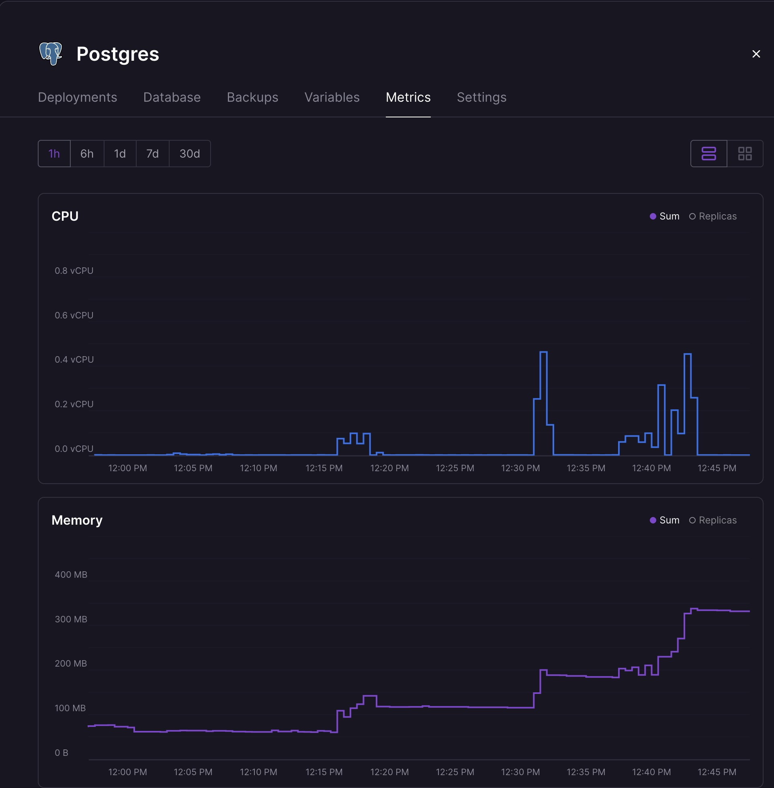
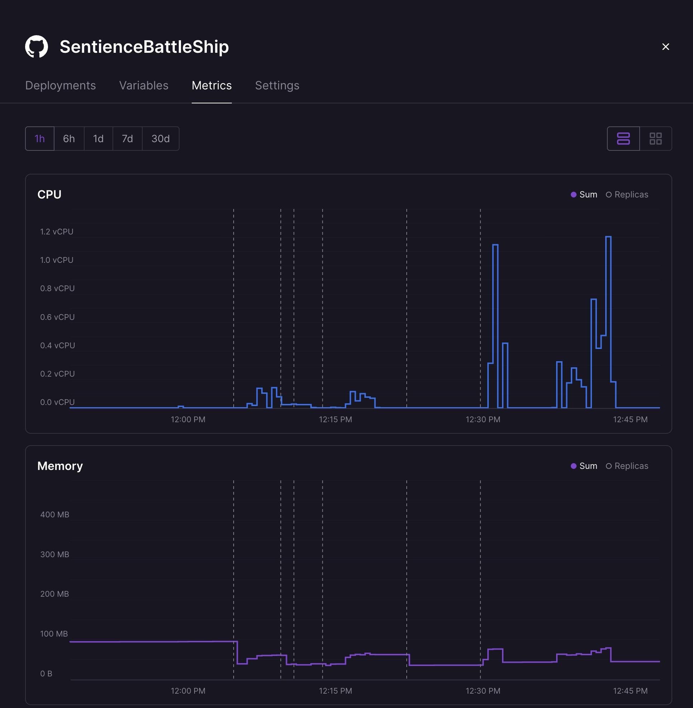
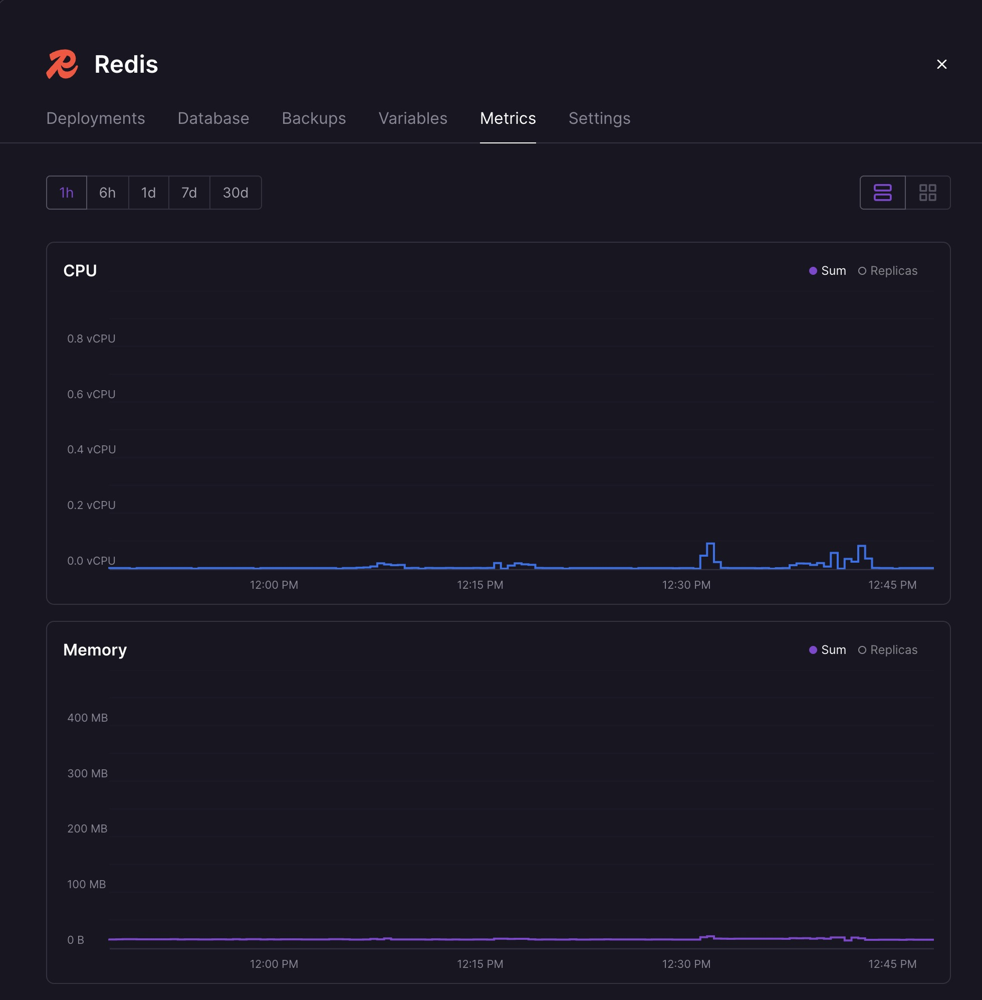
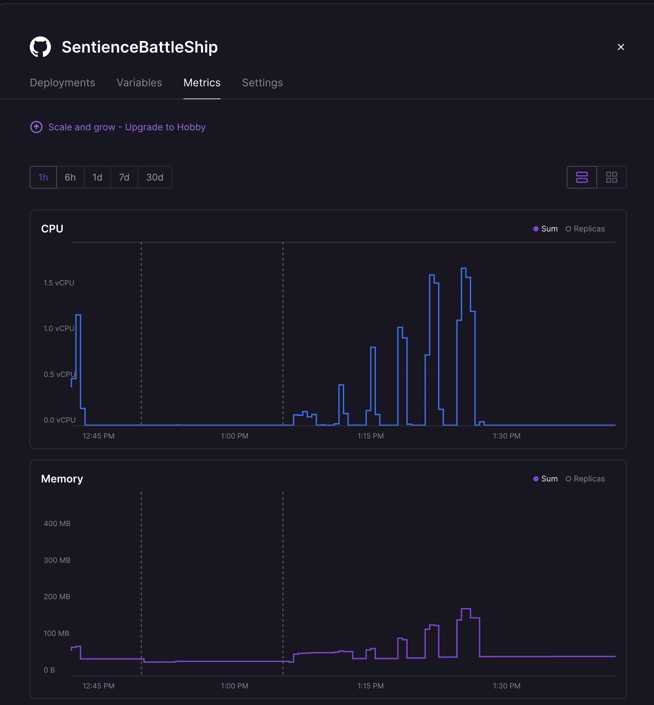
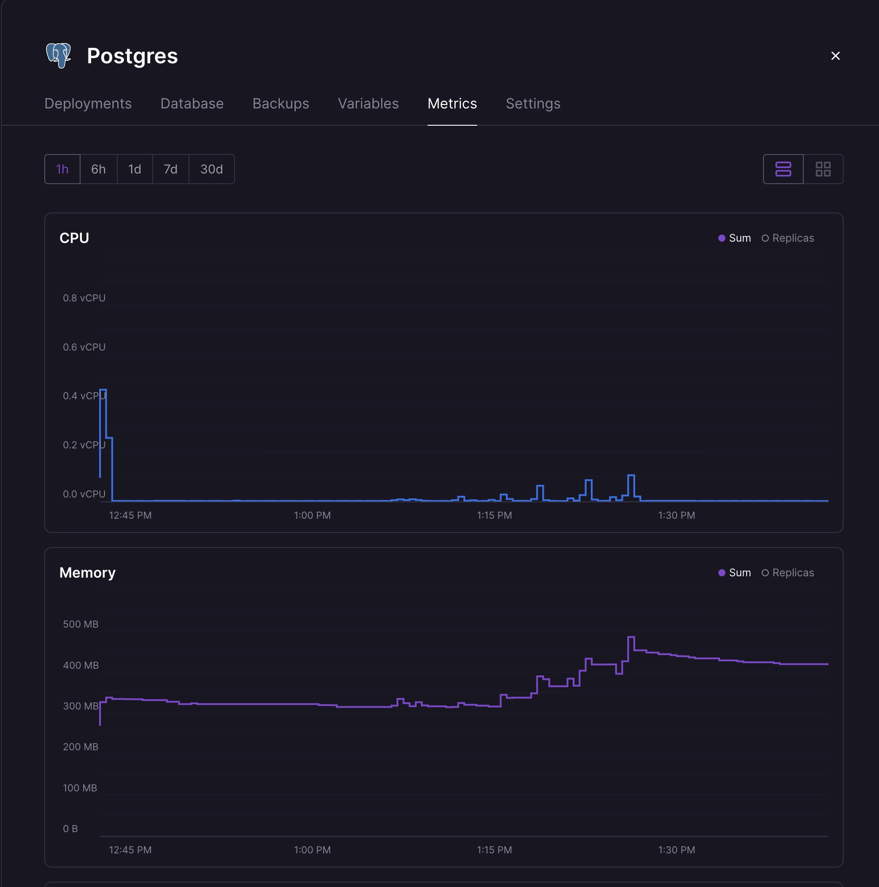
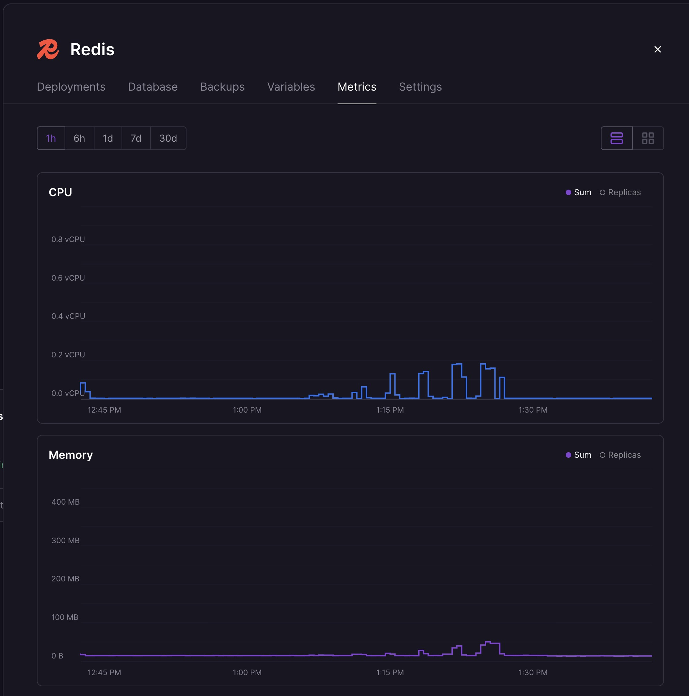

# Spike — Horizontal Scaling

Research spike exploring what it takes to scale a real-time Socket.IO game server horizontally. Started with a single-process Node.js server, ended with a Redis-coordinated multi-instance architecture backed by Postgres, with load test data identifying the bottleneck.

**Platform constraints:** All testing and deployment runs on Railway's free tier, which imposes resource limits on CPU, memory, and database performance. Postgres and Redis are shared managed instances — not dedicated hardware. In production, both could be scaled vertically (larger Postgres instances handle tens of thousands of concurrent connections; Redis can sustain 100k+ ops/sec on dedicated hardware). The bottlenecks identified in this spike are specific to the free-tier resource envelope. The goal was to maximize what a single instance can handle within these constraints, and to prove the architecture scales horizontally when vertical limits are reached.

## Architecture

```
                    ┌──────────────┐
                    │   Railway     │
                    │ Load Balancer │
                    └──────┬───────┘
                           │
              ┌────────────┼────────────┐
              ▼            ▼            ▼
        ┌──────────┐ ┌──────────┐ ┌──────────┐
        │ Node.js  │ │ Node.js  │ │ Node.js  │
        │ Instance │ │ Instance │ │ Instance │
        └────┬─────┘ └────┬─────┘ └────┬─────┘
             │             │             │
     ┌───────┴─────────────┴─────────────┴───────┐
     │                  Redis                     │
     │  • Live game state (1hr TTL)               │
     │  • Distributed locks (SET NX PX)           │
     │  • Socket.IO adapter (cross-process rooms) │
     └───────────────────────────────────────────┘
     ┌───────────────────────────────────────────┐
     │                Postgres                    │
     │  • Game history (moves, outcomes)          │
     │  • Cold storage fallback                   │
     └───────────────────────────────────────────┘
```

### State Tiers

`src/gameStore.js` provides a 3-tier game state lookup:

1. **Redis** (if `REDIS_URL` is set) — primary cache with 1-hour TTL
2. **In-memory fallback** — used when Redis is unavailable
3. **Postgres** — cold storage fallback for games not in cache

Ephemeral state (socket IDs) is kept in a per-process in-memory `socketMap` — sockets are process-local and shouldn't be serialized.

### Socket.IO Redis Adapter

`@socket.io/redis-adapter` enables cross-process room broadcasts. When instance A emits to a game room, the adapter publishes through Redis so instance B's sockets in that room also receive the event. Without this, only sockets connected to the emitting process would get updates.

### Backward Compatibility

Without `REDIS_URL`, the app falls back to in-memory storage and behaves identically to a single-process server. Without `DATABASE_URL`, all Postgres calls are no-ops — the game works but history doesn't persist.

---

## Distributed Locking

`withLock(gameId, fn)` prevents race conditions when concurrent events for the same game hit different server processes. Uses Redis `SET NX PX` (atomic acquire with 5s auto-expire) with retry logic (20 attempts, 50ms delay). Every handler that reads, mutates, and writes game state is wrapped in a lock. Without Redis, `withLock` is a no-op.

### Race Condition Examples

**Lost shot:** Player 1 fires on process A. Process A reads the game from Redis. Before A writes back, Player 2's `place-ships` event hits process B, which also reads the game. Process B writes first (ships placed). Process A writes second (shot recorded) — but its write is based on the stale read, so Player 2's ships are silently erased. With locking, process B blocks until A's read-mutate-write cycle completes.

**Duplicate slot assignment:** Two players click "Join" at the same time, routed to different processes. Both read the game, both see `tokens.p1` exists but `tokens.p2` is empty, both assign themselves as `p2` and generate separate tokens. The second write overwrites the first player's token — that player can never rejoin. With locking, the second join waits until the first completes, sees `tokens.p2` is now taken, and gets rejected with "Game is full."

### Pessimistic vs Optimistic Locking

The current implementation uses pessimistic locking (Redis mutex via `SET NX PX`). Every read-mutate-write acquires a lock first, even when no conflict exists. This guarantees correctness but adds 2 extra Redis round-trips per operation (acquire + release).

An alternative is optimistic concurrency control (OCC): read the game with a version number, mutate locally, and on write check if the version is still what you read. If it is, save and increment. If not, someone else wrote first — retry. No lock overhead on the happy path.

| | Pessimistic (current) | Optimistic (OCC) |
|---|---|---|
| Overhead per operation | 2 Redis round-trips (always) | 0 on happy path, retry on conflict |
| Conflict handling | Block until lock is free | Retry with fresh read |
| Risk | Lock timeout / deadlock (mitigated by 5s TTL) | Livelock under high contention (repeated retries) |
| Complexity | Simple acquire/release | Version tracking + retry logic |
| Best for | High-contention workloads | Low-contention workloads |

Battleship is inherently low-contention — turn-based games rarely produce simultaneous events for the same game. `place-ships` is the only realistic collision window (both players place at the same time). OCC would eliminate lock overhead on ~99.9% of operations while still handling the edge case via retry. Pessimistic locking is the safer default, but OCC is the more efficient choice for this specific workload.

---

## SQLite → Postgres Migration

Replaced SQLite (`better-sqlite3`) with Postgres (`pg`) to remove the volume dependency that blocked horizontal scaling. Railway's persistent volume can only attach to a single instance — with SQLite on a volume, replicas were impossible. Postgres runs as a separate Railway service that all instances connect to via `DATABASE_URL`.

The migration preserved the same `stmts` interface (same method names, same call sites) but made all database calls async. Since every handler was already `async` from the Redis refactor, this was a mechanical change — adding `await` to ~12 call sites. Tables are auto-created on startup via `db.init()`.

---

## Operational Readiness

### Health Check — `GET /api/health`

Returns server status, uptime, Redis connectivity, and memory usage.

```json
{
  "status": "ok",
  "uptime": 376,
  "redis": "connected",
  "memory": { "rss": 70356992, "heapTotal": 14544896, "heapUsed": 12635440 }
}
```

Configured as Railway's healthcheck path — Railway waits for a `200 OK` from the new deployment before routing traffic to it, preventing broken deploys from receiving requests.

### Diagnostics — `GET /api/diagnostics`

Built specifically for bottleneck analysis. Benchmarks each subsystem independently so we can identify what's slow under load:

```json
{
  "redisPingMs": 2.57,
  "redisSetGetDelMs": 8.5,
  "pgPingMs": 52.4,
  "eventLoopLagMs": 0.09,
  "memory": { "rss": 70356992, "heapTotal": 14544896, "heapUsed": 12635440 }
}
```

- **redisPingMs** — Single `PING` round-trip to Redis
- **redisSetGetDelMs** — Full `SET` → `GET` → `DEL` cycle (simulates a lock acquire/release)
- **pgPingMs** — `SELECT 1` round-trip to Postgres
- **eventLoopLagMs** — Time for `setImmediate` to fire (measures Node.js event loop saturation)
- **memory** — V8 heap and RSS usage

### Graceful Shutdown

On `SIGTERM`/`SIGINT` (e.g., Railway deploying a new version), the server:
1. Stops accepting new connections
2. Disconnects all sockets (clients auto-reconnect to another instance via Socket.IO — game state is in Redis so they resume seamlessly)
3. Closes the Redis connection
4. Exits cleanly

A 10-second force-exit timeout prevents hanging if drain stalls.

---

## Load Testing

Custom load test script (`loadtest/run.js`) simulates concurrent AI game lifecycles over Socket.IO, measuring shot-result latency end-to-end against the production Railway deployment. Each test game is a single Socket.IO connection that creates a game, places ships, and exchanges shots with the server-side AI.

Multiplayer games use 2 connections per game, so real-world connection capacity is roughly half the AI game count — though server-side compute per shot is nearly identical.

**Test environment:** 1 Railway instance, Redis, Postgres, `AI_DELAY_MS=5`.

### Baseline

| Metric | Value |
|---|---|
| Concurrent games | 50 |
| Rounds | 3 |
| Total games completed | 149 / 150 |
| Errors | 1 |
| Total shots processed | 9,207 |
| Shot latency p50 | 97ms |
| Shot latency p95 | 110ms |
| Shot latency p99 | 126ms |
| Min / Max latency | 89ms / 321ms |

Latency stayed flat across all 3 rounds — no degradation under sustained load. The ~97ms floor is network round-trip time from the test client to Railway plus the 5ms AI delay.

### Stress Test — Single Instance Breaking Point

| Concurrent Games | Completed | Errors | p50 | p95 | p99 | Max |
|---|---|---|---|---|---|---|
| 50 (×3) | 149/150 | 1 | 97ms | 110ms | 126ms | 321ms |
| 200 | 191/200 | 9 | 105ms | 195ms | 293ms | 370ms |
| 400 | 71/400 | 329 | 292ms | 489ms | 610ms | 632ms |

A single instance handles ~200 concurrent AI games cleanly. At 400, p50 triples and 82% of games time out. Errors are 60-second timeouts, not state corruption or data loss — the system degrades gracefully.

### Unit Capacity

~200 concurrent AI games per instance, or ~100 multiplayer games (2 connections each). Using 200 games/instance as the safe operating ceiling.

### Capacity Planning — 5,000 Concurrent Games

| | AI games | Multiplayer games |
|---|---|---|
| Target concurrency | 5,000 | 5,000 |
| 2× headroom for spikes | 10,000 | 10,000 |
| Connections per game | 1 | 2 |
| Total connections | 10,000 | 20,000 |
| Safe capacity per instance | 200 games | 100 games |
| Instances required | 50 | 100 |

Redis is the shared coordination layer — all instances read/write game state through it, so adding instances is purely horizontal.

---

## Bottleneck Analysis

We hit the diagnostics endpoint during a 400-game stress test to identify what breaks first:

| Metric | Idle | Under 400 games | Change |
|---|---|---|---|
| Redis ping | 2.4ms | 2.4ms | — |
| Redis set/get/del | 5.7ms | 10ms | +75% |
| **Postgres ping** | **47ms** | **88ms** | **+87%** |
| Event loop lag | 0.14ms | 0.19ms | — |
| Memory (RSS) | 71MB | 99MB | +39% |

**Postgres is the bottleneck.** Redis barely moves under load. The event loop isn't saturated. Memory is fine. But every shot triggers 2 Postgres writes (`insertMove` + `saveState`/`updateGame`), each taking 50-90ms. That's 100-180ms of Postgres I/O per shot, which dominates the total latency and explains why p50 jumps from 97ms to 292ms at 400 games.

### Why Postgres Is Slow

Railway's Postgres is a managed instance on shared infrastructure. The ~50ms idle latency suggests it's not co-located with the app instance (likely different availability zones or even regions). Each shot does:

1. `INSERT INTO moves (...)` — records the shot for game history
2. `UPDATE games SET state = ...` — persists the full game state as JSON

Both are synchronous `await` calls in the shot handler's critical path. Under load, Postgres connection pool contention adds further delay.

**Railway metrics during stress test (before optimization):**


*Postgres: CPU spikes to 0.4 vCPU during the 400-game stress test, memory steadily climbs from ~75MB to 300MB as it handles thousands of individual INSERT/UPDATE queries.*


*Node.js app: CPU peaks at 1.2 vCPU during the stress tests (12:30–12:45 PM), memory stays stable around 100MB — the app itself isn't the bottleneck.*


*Redis: CPU barely registers (< 0.1 vCPU), memory near zero. Redis is not the bottleneck.*

### Optimization — Batch Postgres Writes to End-of-Game

Rather than leaving these as theoretical proposals, we implemented the most impactful optimization: removing Postgres from the critical path entirely.

**What changed:**
- Removed all mid-game `insertMove` and `saveState` calls from `processShot` and `aiTakeTurn`
- Added `game.moveLog[]` — an in-memory buffer that accumulates moves during gameplay (persisted to Redis alongside game state)
- Added `flushGame()` — a single Postgres transaction at game end that batch-inserts all moves and writes the final game state
- Every shot went from 2 Postgres round-trips (~100-180ms) to 0

**Before:** Each shot → `INSERT INTO moves` + `UPDATE games` → 2 awaited Postgres queries in the critical path.
**After:** Each shot → Redis only. Game end → 1 transaction with batch `INSERT` + `UPDATE`.

### Post-Optimization Results

Re-ran the full stress test suite after removing Postgres from the hot path:

| Concurrent Games | Completed | Errors | p50 | p95 | p99 | Max |
|---|---|---|---|---|---|---|
| 50 (×3) | 149/150 | 1 | 86ms | 93ms | 98ms | 214ms |
| 200 | 200/200 | 0 | 88ms | 102ms | 113ms | 310ms |
| 400 | 400/400 | 0 | 92ms | 118ms | 134ms | 209ms |
| 800 | 800/800 | 0 | 112ms | 270ms | 306ms | 383ms |
| 1,500 | 1,498/1,500 | 2 | 388ms | 661ms | 764ms | 1,413ms |
| 2,000 | 2,000/2,000 | 0 | 679ms | 1,007ms | 1,073ms | — |

**Before vs after comparison:**

| Games | Before (Pg in hot path) | After (Pg batched) |
|---|---|---|
| 200 | 191/200, p50=105ms | 200/200, p50=88ms |
| 400 | 71/400, p50=292ms | 400/400, p50=92ms |
| 800 | untestable (90%+ errors) | 800/800, p50=112ms |

Removing Postgres from the hot path increased single-instance capacity from ~200 to ~1,000 concurrent games — a **5× improvement**. The system now handles 800 games with zero errors and p99 under 310ms. At 1,500 games latency starts climbing but games still complete. At 2,000 everything completes but p50 crosses 600ms.

**Diagnostics during 400 games (post-optimization):**

| Metric | Idle | Under 400 games |
|---|---|---|
| Redis ping | 2.4ms | 6.1ms |
| Redis set/get/del | 5.7ms | 11.7ms |
| **Postgres ping** | **47ms** | **7ms** |
| Event loop lag | 0.14ms | 0.12ms |
| Memory (RSS) | 71MB | 97MB |

Postgres dropped from 88ms to 7ms under load — it's barely touched during gameplay now.

**Railway metrics during stress test (after optimization):**


*Node.js app: CPU peaks at 1.7 vCPU during the 1,500–2,000 game tests (1:15–1:30 PM). The app is now doing all the work — Redis I/O and game logic, no Postgres in the loop.*


*Postgres: CPU is near zero during the stress tests — only brief spikes when games end and batch-flush their moves. Memory stable. Night and day compared to the pre-optimization screenshot.*


*Redis: Small CPU bumps visible now (0.1–0.2 vCPU) as it handles all live game state. Still well within capacity.*

### Updated Unit Capacity

Conservative safe ceiling: **~1,000 concurrent AI games per instance** (p99 < 200ms). Multiplayer games use 2 connections each, so ~500 multiplayer games per instance.

### Revised Capacity Planning

Using 1,000 AI games / 500 multiplayer games per instance as the safe ceiling, with 2× headroom for traffic spikes:

| Target users | With 2× spike headroom | AI-only instances | Multiplayer instances | Mixed (est.) |
|---|---|---|---|---|
| 10,000 | 20,000 | 20 | 40 | ~30 |
| 50,000 | 100,000 | 100 | 200 | ~150 |
| 100,000 | 200,000 | 200 | 400 | ~300 |

Redis is the shared coordination layer — all instances read/write game state through it, so adding instances is purely horizontal with no code changes.

### Next Bottleneck: Redis

With Postgres out of the hot path, Redis is now the ceiling. Each shot does:
- Lock acquire (`SET NX PX`) — ~3ms
- Game read (`GET`) — ~3ms
- Game write (`SET EX`) — ~3ms
- Lock release (`DEL`) — ~3ms

That's ~12ms of Redis I/O per shot. At the 50,000+ game scale, a single Redis instance would become saturated. Options at that point:
- **Redis Cluster** — shard game keys across multiple Redis nodes
- **Optimistic concurrency control** — eliminate lock acquire/release round-trips (saves ~6ms per shot)
- **Redis pipelining** — batch the read + write into a single round-trip
